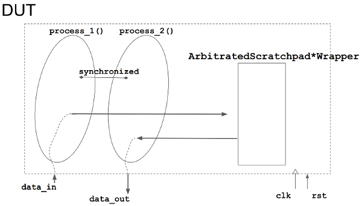

# MatchLib Arbitrated Scratchpads for SystemC Shared Memories

We provide two example of designs, `ArbitratedScratchpadWrapper` and `ArbitratedScratchpadDPWrapper`, that use the [MatchLib memory components](https://nvlabs.github.io/matchlib/group___arbitrated_scratchpad.html) `ArbitratedScratchpad` and `ArbitratedScratchpadDP` to model shared memories.

The designs share memories among SystemC processes and are paradigmactic of the load-compute-store-process structure in ESP accelerators, but simpler.

In both the designs, the top module has two processes that behave like in the following pseudo-code and image:

```
process_1: // producer
for (i = 0; i < BURST_COUNT; i++)
    for (j = 0; j < BURST_SIZE; j++)
        data = read_data_from_testbench();
        index = (i * BURST_SIZE + j) % MEM_SIZE
        arbitrated_scratchpad_wrapper.port1.write(index, data)
    sync_with_the_other_process()

process_2: // consumer
for (i = 0; i < BURST_COUNT; i++)
    sync_with_the_other_process()
    for (j = 0; i < BURST_SIZE; i++)
        index = (i * BURST_SIZE + j) % MEM_SIZE
        data = arbitrated_scratchpad_wrapper.port2.read(index)
        write_data_to_testbench(data)
```



The processes operate in bursts (`BURST_COUNT` bursts in total) of size `BURST_SIZE`; `process_1` reads `BURST_SIZE` words from the testbench and write them to a module either `ArbitratedScratchpadWrapper` or `ArbitratedScratchpadDPWrapper`; these modules wrap the MatchLib arbitrated scrathpad; once `process_1` completes a burst it syncs with the `process_2`; finally, `process_2` reads those words back from the memory wrapper and send them back to the testbench for validation.


To replicate the experiments:

```
./get_boost_1_68_0.sh
```

```
cd <ArbitratedScratchpad*Wrapper>
make
make run
make syn
```

## References

- [Slides](https://docs.google.com/presentation/d/1pwKd-JKmadxN98U0Qt4mZs1unXBNXEb6HYyhML4dOEI/edit?usp=sharing)
